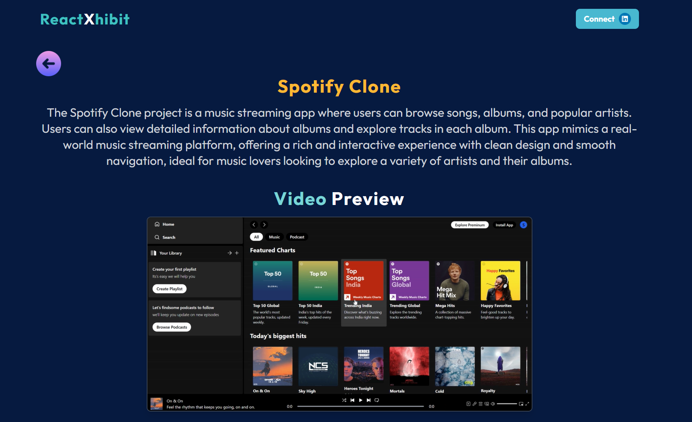

# 🌟 ReactXhibit  

**ReactXhibit** is a showcase of engaging Mini React projects! Dive into a clean, responsive, and dynamic interface that highlights the power and versatility of React.  

---  

## 🚀 Features  

- 🎨 **Showcase Mini React Projects**: Explore a curated collection of React-based projects.  
- 🛤️ **Dynamic Routing**: Seamlessly navigate through individual project details with React Router.  
- 🔔 **Notifications**: Receive user feedback with toast alerts powered by `react-toastify`.  
- 📱 **Responsive Design**: Fully optimized for all screen sizes.  
- ⚡ **Reusable Components**: Modular and scalable React architecture.  

---  

## 🌐 Live Demo  

👉 [View ReactXhibit Live!](https://reactxhibit.vercel.app/)  

---  

## 🛠️ Tech Stack  

- **React**: For building the UI.  
- **React Router**: To enable smooth navigation.  
- **React Toastify**: For notifications.  
- **Tailwind CSS**: For styling.  
- **JavaScript**: The backbone of React applications.  

---  

## 📥 Installation  

Follow these steps to run the project locally:  

1. **Clone the repository**:  
   ```bash  
   git clone https://github.com/SyedShahulAhmed/ReactXhibit.git  
   ```  

2. **Install dependencies**:  
   ```bash  
   npm install  
   ```  

3. **Start the development server**:  
   ```bash  
   npm run dev  
   ```  

4. **Open the app**: Visit [http://localhost:3000](http://localhost:3000) in your browser.  

---  

## 🖼️ Screenshots  

### 🏠 Home Page  

  

### 🔍 Project Details Page  

  

---  

## 🤝 Contributions  

We welcome contributions! Here's how you can help:  

1. Fork this repository.  
2. Create a new branch:  
   ```bash  
   git checkout -b feature-name  
   ```  
3. Make your changes and commit:  
   ```bash  
   git commit -m "Add feature-name"  
   ```  
4. Push to your branch:  
   ```bash  
   git push origin feature-name  
   ```  
5. Open a pull request on GitHub.  

---  

## 💬 Contact  

Feel free to reach out for questions or suggestions:  

- **Author**: Shahul Ahmed  
- **Email**: shahul77235@gmail.com  
- **GitHub**: [https://github.com/SyedShahulAhmed](https://github.com/SyedShahulAhmed)  
